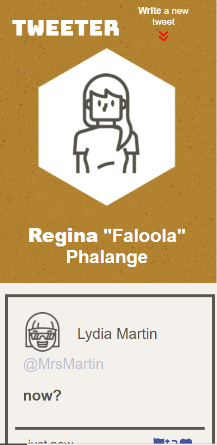
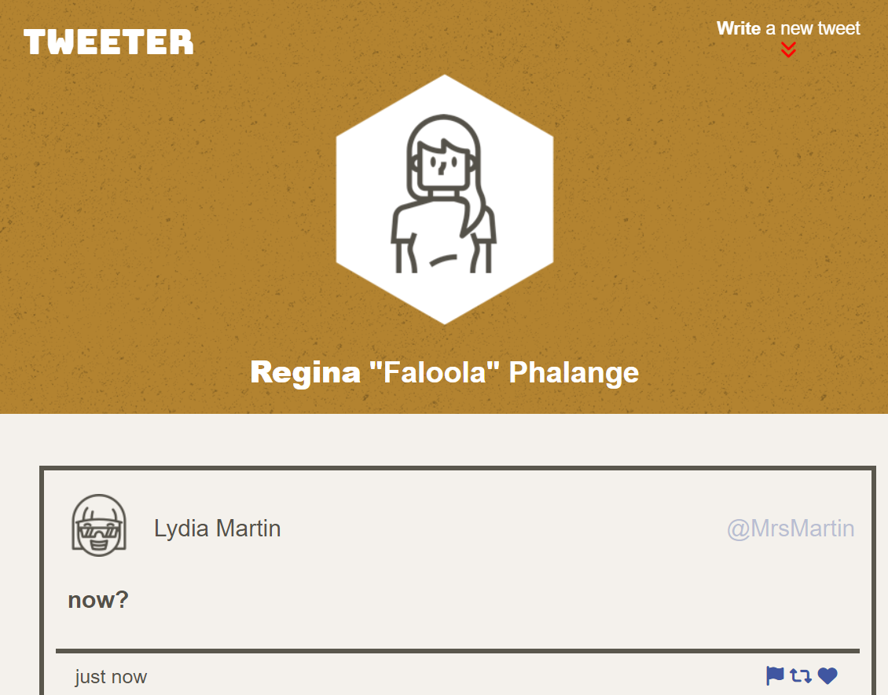
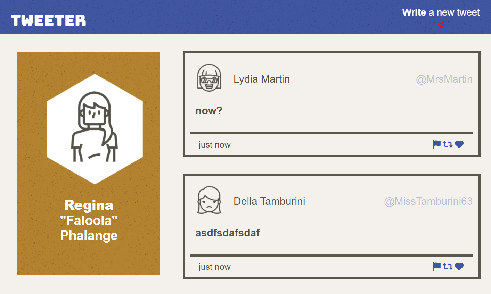
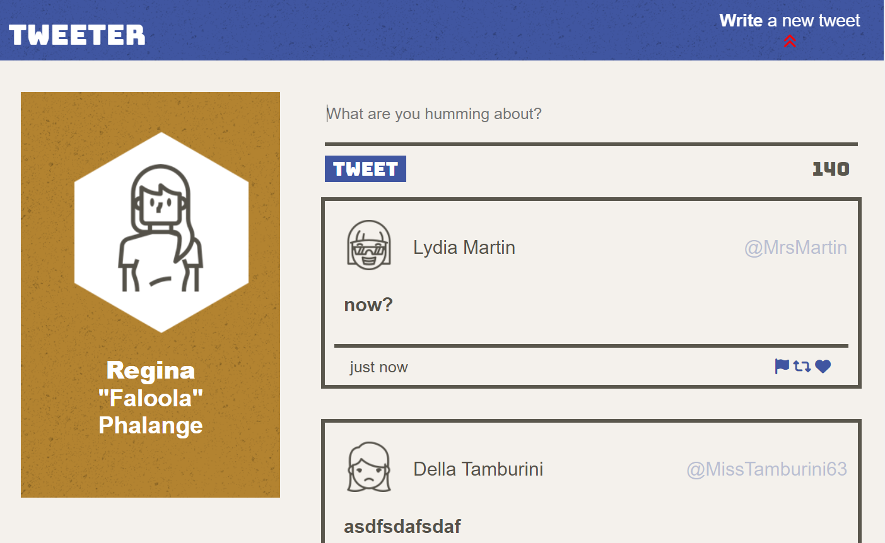
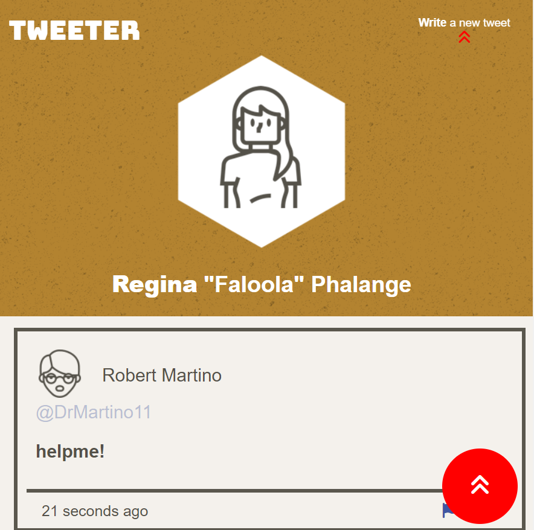

# Tweeter Project

Tweeter is a simple, single-page Twitter clone.

This repository was practice for HTML, CSS, JS, jQuery and AJAX front-end skills, and their Node, Express back-end skills.

## Final Product

1. Small Phone:

2. Tablet:

3. Full-size:

4. Form for new tweet:

5. Up to top Button when scrolling:

## Getting Started

1. [Create](https://docs.github.com/en/repositories/creating-and-managing-repositories/creating-a-repository-from-a-template) a new repository using this repository as a template.
2. Clone your repository onto your local device.
3. Install dependencies using the `npm install` command.
3. Start the web server using the `npm run local` command. The app will be served at <http://localhost:8080/>.
4. Go to <http://localhost:8080/> in your browser.

## Dependencies

- Express
- Node 5.10.x or above
- chance
- body-parser
- md5
